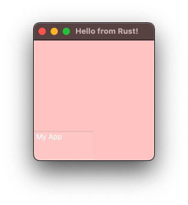

# sycamore-mac

## Help Wanted

Sycamore makes it really easy to extend, almost simply by implementing [GenericNode](https://docs.rs/sycamore/0.5.0-beta.0/sycamore/generic_node/trait.GenericNode.html).

Main issue is figuring out to create the Mac UI using [cocoa](https://docs.rs/cocoa/0.24.0/cocoa/) & [objc](https://docs.rs/objc/0.2.7/objc/), plus lots of trial and error reading the [AppKit](https://developer.apple.com/documentation/appkit/nsview) documentation. 🥴

Right now strugglying to figure out how to auto layouts, so that components positions & sizes don't need to be manually set--something like the flexbox model would be ideal.



And yes, making the window transparent is easily done. :}

```rust
window.setBackgroundColor_(NSColor::colorWithCalibratedRed_green_blue_alpha_(nil, 1.0, 0.5, 0.5, 0.5));
```

## Getting started with this WIP

```bash
git clone https://github.com/Submersible/sycamore-mac.git
cd sycamore-mac
cargo run --example simple_example
```
