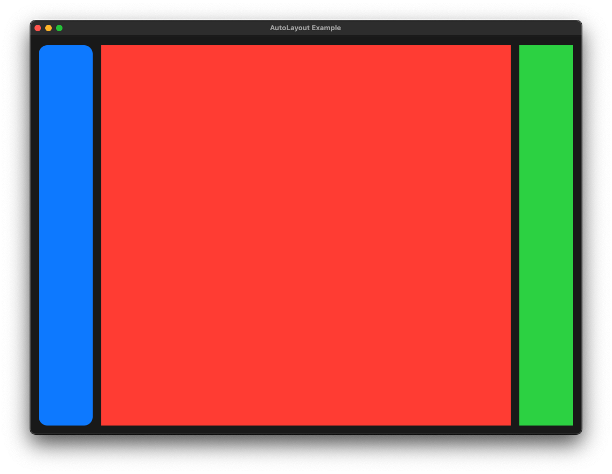

# sycamore-mac


Yes that window is transparent. :}

```rust
window.setBackgroundColor_(NSColor::colorWithCalibratedRed_green_blue_alpha_(nil, 1.0, 0.5, 0.5, 0.5));
```

## Getting started with this WIP

```bash
git clone https://github.com/Submersible/sycamore-mac.git
cd sycamore-mac
cargo run --example simple_example
```

## Help Wanted

Sycamore makes it really easy to extend, almost simply by implementing [GenericNode](https://docs.rs/sycamore/0.5.0-beta.0/sycamore/generic_node/trait.GenericNode.html).

Main issue is figuring out to create the Mac UI using [cocoa](https://docs.rs/cocoa/latest/cocoa/) & [objc](https://docs.rs/objc/latest/objc/), plus lots of trial and error reading the [AppKit](https://developer.apple.com/documentation/appkit/nsview) documentation. 🥴

### Todo...

-   [ ] View component
    -   [ ] Simple horizontal & vertical layouts
    -   [ ] Children with constant sizes
-   [ ] Text component
    -   [ ] Text font family
    -   [ ] Text color
    -   [ ] Text size
-   [ ] Text input component
    -   [ ] Change event binding
-   [ ] Component
    -   [ ] Click event
    -   [ ] Mouse move event
-   [ ] Window component
-   [ ] Create more todo items...
-   [x] Launching a window on Mac, from a sycamore template (bindings don't work)

### Auto Layout

Right now strugglying to figure out how to auto layouts, so that components positions & sizes don't need to be manually set--something like the flexbox model would be ideal.

-   It seems like the like [cacao](https://docs.rs/cacao/latest/cacao/) provides a much better interface than [cocoa](https://docs.rs/cocoa/latest/cocoa/), plus there is an example that shows exactly how to use [Auto Layout](https://developer.apple.com/library/archive/documentation/UserExperience/Conceptual/AutolayoutPG/LayoutUsingStackViews.html):
    https://github.com/ryanmcgrath/cacao/blob/f558f8e24d6c4f869a4135bd230222455a435dcf/examples/autolayout.rs

    To preview this functionality:

    ```bash
    git clone https://github.com/ryanmcgrath/cacao.git
    cd cacao
    cargo run --example autolayout
    ```

    

-   There's also someone using [NSLayoutConstraint](https://github.com/ilammy/cartouche/blob/536a68c90455950f90d6f3f664bcea9b9224eb2c/src/cacao/layout_constraint.rs) directly through [objc](https://docs.rs/objc/latest/objc/), but this looks less fun, and no rust crate to import.
